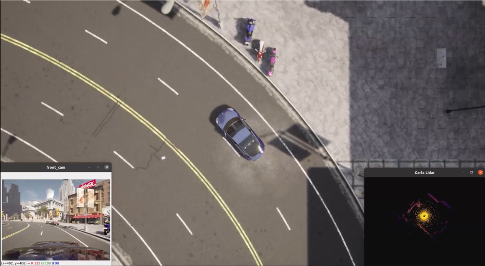

### Code for Capturing multiple sensor data on Carla platform
___

We provide an example code to capture data for multiple sensors in synchronous mode on [Carla](https://carla.org/) platform.

CARLA is an open-source autonomous driving simulator. The simulation platform supports flexible specification of sensor suites, environmental conditions, full control of all static and dynamic actors, maps generation and much more.



#### Features
* route than can be adjusted
* synchronous mode
* lidar, camera, gnss and IMU
* save the data to the disk
* display mode
* follow ego vehicle in bird's-eye view
* ignore the traffic lights


#### Testing system
* Intel i7 gen 9th
* 16 GB RAM memory
* NVIDIA RTX 2080Ti
* Ubuntu 20.04

#### Dependencies
1. CarlaUE 4.26
2. Carla simulator 0.9.12
3. Numpy
4. OpenCV
5. matplotlib
6. Pillow

#### Run
* fixed route, you can change the route in the route file (e.g.Route_Town07.txt)
```
python3 route_capture_multiple_sensors.py --fix_route
```
* random route
```
python3 route_capture_multiple_sensors.py 
```
* random roam on the map
```
python3 capture_multiple_sensors.py
```

